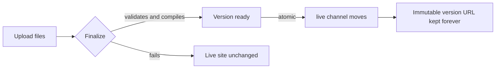

Spacefast's model is small. Six nouns carry the whole product, and every
page in these docs describes an operation on one of them.

| Noun         | Meaning                                                             |
| ------------ | ------------------------------------------------------------------- |
| **Space**    | The durable resource behind a site, with one stable live URL.       |
| **Publish**  | The verb that ships content. Every changed publish makes a version. |
| **Version**  | An immutable snapshot with its own permanent URL.                   |
| **Team**     | The ownership and billing boundary for spaces, domains, and keys.   |
| **Domain**   | A custom hostname attached to a space.                              |
| **Variable** | A space-scoped config value. Secrets stay write-only.               |

## A publish either lands whole or not at all

A [publish](/publish) uploads files and then finalizes. Finalization
validates the complete snapshot, compiles its serving rules, and promotes it
atomically. A request never sees half of a release. Until the new version is
ready, the live URL serves the old one, and a failed publish leaves the
current site alone. If you publish content identical to the current version,
Spacefast records a no-op instead of creating a new version.

Each publish receipt carries two addresses. The **live URL** is the space's
stable address, and its content changes when you publish or roll back. The
**version URL** serves exactly the bytes you published, forever.

## The live URL is a pointer

The live URL is a pointer called a **channel**. A successful publish moves
the `live` channel to the new version. [Rollback and promote](/publish/versions)
move the same pointer to a version that already exists, so recovery takes
seconds. Nothing is rebuilt or re-uploaded. Channel history records every
move.

## What rolls back with a version

A version is more than files. Spacefast compiles everything that shapes how
those files serve into the snapshot and restores it on rollback:

- [`sf.jsonc`](/serve/settings), the space configuration.
- [`_redirects`](/serve/redirects) and [`_headers`](/serve/headers) rules.
- [Custom visitor pages and layouts](/serve/pages).
- [Zero](/zero-runtime) or [Functions](/functions) code, when the space runs a
  runtime.

Other things belong to the space rather than the version, and they do not
roll back:

- [Domains](/domains).
- [Variables](/publish/variables).
- [Grants](/share) and comment threads.
- Database rows and stored objects, for spaces that run code.

## Access and claiming

Claimed spaces start private. A URL identifies content. It does not grant
access. [Grants](/share) admit people, links, passwords, machines, or the
public, per path and per role.

You can also publish before you have an account. An [anonymous
publish](/publish/anonymous) creates a working space and returns a claim
link. To keep the space, claim it within 6 hours. Agents use this flow by
default. They publish first, then hand the claim link to the person they
work for.

## One API underneath

The dashboard, the [CLI](/cli), the [SDK](/reference/sdk), and
[agents](/agents) all drive the same [REST API](/api). Anything one of them
can do, the others can too, and every mutation returns a receipt you can
treat as the source of truth.

Next, [publish your first site](/start) or read
[how publishing works](/publish).
